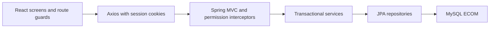

# Requirements and architecture

Reference: user-supplied OOAD_SE2012_Project_Context.html, reviewed 2 October 2026. Requirements IDs are the project's baseline, not lecturer-issued IDs. This private fork is developed personally by the user across all three historical member domains.

## Architecture

The server is authoritative for permissions and integrity. Route guards improve navigation; they do not replace server checks. SessionRefreshInterceptor reloads the user's role before protected requests. CatalogueAuthorizationInterceptor limits catalogue writes to Admin. Admin account operations reload the acting user's role; Staff can operate orders/inventory. Customer cart/order access checks ownership.

Entities include User, Category, Product, Cart, CartItem, Order, OrderItem, SavedAddress and temporary registration/reset challenges. Inventory is Product.quantity; roles are CUSTOMER/STAFF/ADMIN on User. Product.version guards concurrent entity updates. Order.checkoutKey supports retry identity. Cart prices are captured per line and used at checkout. No separate Inventory/Role table or role subclasses are implied.

## Functional traceability

| ID | Requirement | UI / API evidence |
| --- | --- | --- |
| FR01 | Customer registration | RegisterPage; emailed registration OTP, verification/resend APIs; role forced to CUSTOMER |
| FR02 | All-role login | LoginPage; login/me/logout APIs; role-specific initial destination |
| FR03 | Browse products | ProductBrowser; GET /api/products/browse with server pagination |
| FR04 | Search products | Server-side name/description search |
| FR05 | Category/price/availability filters | URL-backed catalogue filters; applied by backend |
| FR06 | Product details | ProductDetails; GET /api/products/{id} |
| FR07 | Availability | Catalogue/detail stock and out-of-stock labels |
| FR08 | Cart operations | Cart/ProductDetails; authenticated cart item add/update/remove |
| FR09 | Checkout | CheckoutPage; POST /api/cart/{userId}/checkout with X-Checkout-Key and validated fulfilment details |
| FR10 | Submit order | Transactional order/items, atomic stock deductions, cart clearing |
| FR11 | Own orders/status | OrderList; customer order and order item APIs |
| FR12 | View customer orders | AdminOrders reused in staff workspace; status/customer ID lookup |
| FR13 | Process orders | Order management page and service transition checks |
| FR14 | Update status | Staff/Admin PUT order status; allowed transitions only |
| FR15 | Check stock | Inventory page; Staff/Admin inventory reads |
| FR16 | Update stock | Stock editor; Staff/Admin stock API |
| FR17 | Product CRUD | Admin catalogue; server Admin enforcement |
| FR18 | Category CRUD | Admin categories; server Admin enforcement |
| FR19 | Manage inventory | Search/availability filters, totals, stock editor |
| FR20 | Manage users | Admin list/create accounts; no password fields in responses |
| FR21 | Manage staff | Admin creates STAFF accounts, changes their roles |
| FR22 | Roles/permissions | Admin role editor, last-admin guard, current-session permission refresh |

Personal fork extensions, authorized separately from the original context: registration-only email OTP, forgotten-password codes, profile/password editing, owned saved addresses, delivery/collection review, server catalogue pagination, admin image uploads, dashboard aggregates and post-commit order emails. Account disable/delete is not implemented. Customer lookup uses ID because the account list remains admin-only.

## Non-functional evidence and limits

| ID | Quality | Current evidence / remaining validation |
| --- | --- | --- |
| NFR01 | Performance | Local smoke response timing recorded; no agreed load or latency target |
| NFR02 | Usability | Role workspaces, labels, loading/error/retry feedback; representative user study pending |
| NFR03 | Security | BCrypt, session ID rotation, server permissions, role refresh, password-free DTOs, production secret config, credential-version session expiry and bounded login throttling |
| NFR04 | Reliability | Validation and conflict responses; health endpoint; API error UI; automated negative cases |
| NFR05 | Maintainability | Layered code, shared services/styles, focused commits, test/documentation links |
| NFR06 | Scalability | Atomic stock updates and serialized per-customer cart changes; server catalogue pagination; load testing pending |
| NFR07 | Availability | Health endpoint and reproducible container files; local backup restoration verified; hosted uptime pending |
| NFR08 | Compatibility | Browser smoke checks and wrapping navigation; full desktop/mobile/browser matrix pending |
| NFR09 | Integrity | Rollback, duplicate checkout, concurrent last-unit purchase, cart merging and cancellation restock tests |

No numeric capacity, uptime or response-time target was supplied. These qualities are not all proven by passing tests. Production hosting, client validation and load/browser studies remain separate evidence.

## Business rules

- Required product/category fields and positive price/non-negative stock are validated.
- Catalogue writes are Admin only; inventory/order operations are Staff or Admin.
- Customer ownership is enforced for cart and order access.
- Referenced catalogue deletion returns 409; order history and active cart references are preserved.
- Adding to a cart does not reserve stock. Checkout conditionally deducts stock inside the transaction.
- One customer row lock serializes cart mutations and checkout. Product deductions use a conditional SQL update, in product-ID order.
- All order/cart/stock writes roll back together if checkout fails. Reusing a checkout key returns the original customer order; the key must not be reused for a different intended purchase.
- Status progression and cancellation restocking are the documented provisional fork policy, subject to client review.
- The user selected delivery and store collection, with LKR 249 delivery and free collection. The server calculates fees and snapshots recipient/contact/address details. Checkout reviews these before submission. Payment handling, refunds and cart repricing still require business decisions; no online payment is taken.
